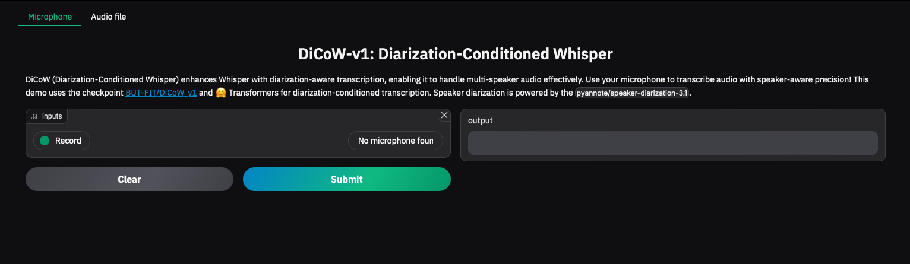

# DiCoW: Diarization-Conditioned Whisper for Target Speaker Automatic Speech Recognition

DiCoW (Diarization-Conditioned Whisper) enhances OpenAI’s Whisper ASR model by integrating **speaker diarization** for multi-speaker transcription. The app leverages `pyannote/speaker-diarization-3.1` to segment speakers and provides diarization-conditioned transcription for long-form audio inputs.

Training and inference source codes can be found here: [TS-ASR-Whisper](https://github.com/BUTSpeechFIT/TS-ASR-Whisper)

> 🔄 **Note:** The updated model and inference pipeline are available in the [`dicow_v3`](https://github.com/BUTSpeechFIT/DiCoW/tree/dicow_v3) branch.

## Features

- **Multi-Speaker ASR**: Handles multi-speaker audio using diarization-aware transcription.  
- **Flexible Input Sources**:  
  - **Microphone**: Record and transcribe live audio.  
  - **Audio File Upload**: Upload pre-recorded audio files for transcription.  
- **Diarization Support**: Powered by `pyannote/speaker-diarization-3.1` for accurate speaker segmentation.  
- **Built with 🤗 Transformers**: Uses the latest Whisper checkpoints for robust transcription.  

**Disclaimer**: This version of DiCoW currently supports **English only** and is still under **active development**. Expect frequent updates and feature improvements.

## Demo

  

### Online Usage
Run the app directly in your browser with [Gradio app](https://pccnect.fit.vutbr.cz/gradio-demo).

## Installation

### Requirements

Before running the app, ensure you have the following installed:

- **Python 3.11**  
- **FFmpeg**: Required for audio processing.
- Python Libraries:  
  - `gradio`  
  - `transformers`  
  - `pyannote.audio`  
  - `torch`
  - `librosa`
  - `soundfile`

### Setup

1. Clone the repository:  
```bash 
   git clone https://github.com/your-username/DiCoW-v1.git  
   cd DiCoW-v1  
```
2. Setup dependencies:
   ```bash
   pip install -r requirements.txt
   ```
3. Export your Hugging Face API token:
   ```bash
   export HF_TOKEN=''
   ```
## Usage

Run the application locally:  
```bash
python app.py  
```

Once the server is running, access the app in your browser at `http://localhost:7860`.

### Linux service

If you want to run this demo on background, it may be good to make a service out of it. (some distros kill the background jobs when user logs out, hence kill the demo).

To register the demo as service, first edit `./run_server.sh` and `./DiCoW-background.service` and set proper paths and users. It is important to set the conda correctly in `./run_server.sh` 
as the service is started out of the userspace (`.profile`).

Then register and start the service (run as root):
```
systemctl enable ./DiCoW-background.service #register the service
systemctl start DiCoW-background.service #start
systemctl status DiCoW-background.service #check if it is running
systemctl stop DiCoW-background.service #stop
systemctl disable DiCoW-background.service #will not start on restart anymore
```

### Modes

1. **Microphone**: Use your device’s microphone for live transcription.  
2. **Audio File Upload**: Upload pre-recorded audio files for diarization-conditioned transcription.  

## Contributing
We welcome contributions! If you’d like to add features or improve the app, please open an issue or submit a pull request.

## License
This project is licensed under the [Apache License 2.0](LICENSE).

## Citation
If you use our model or code, please, cite:
```
@misc{polok2024dicowdiarizationconditionedwhispertarget,
      title={DiCoW: Diarization-Conditioned Whisper for Target Speaker Automatic Speech Recognition}, 
      author={Alexander Polok and Dominik Klement and Martin Kocour and Jiangyu Han and Federico Landini and Bolaji Yusuf and Matthew Wiesner and Sanjeev Khudanpur and Jan Černocký and Lukáš Burget},
      year={2024},
      eprint={2501.00114},
      archivePrefix={arXiv},
      primaryClass={eess.AS},
      url={https://arxiv.org/abs/2501.00114}, 
}
@misc{polok2024targetspeakerasrwhisper,
      title={Target Speaker ASR with Whisper}, 
      author={Alexander Polok and Dominik Klement and Matthew Wiesner and Sanjeev Khudanpur and Jan Černocký and Lukáš Burget},
      year={2024},
      eprint={2409.09543},
      archivePrefix={arXiv},
      primaryClass={eess.AS},
      url={https://arxiv.org/abs/2409.09543}, 
}
```

## Contact
For more information, feel free to contact us: [ipoloka@fit.vut.cz](mailto:ipoloka@fit.vut.cz), [xkleme15@vutbr.cz](mailto:xkleme15@vutbr.cz).
